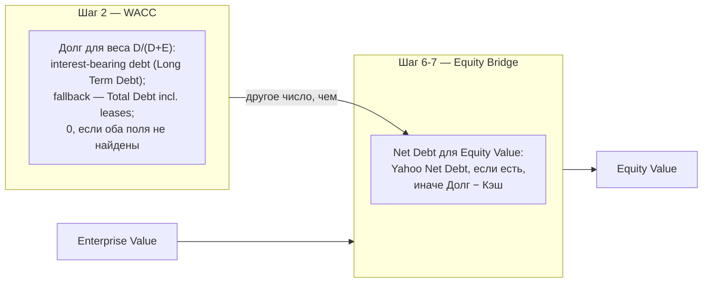

# Fundamental Express Analyzer

Автоматизированный фундаментальный анализ по методике экспресс-анализа (чеклист «грехов» баланса/кэш-флоу)
+ DCF-оценка справедливой стоимости (CAPM WACC). Данные — только реальные, с Yahoo Finance
через `yfinance`. **Без фоллбэка на мок-данные**: если Yahoo не отдал данные после серии
повторных попыток, скрипт прямо говорит об этом и ничего не рисует, вместо того чтобы
подсунуть правдоподобные, но вымышленные цифры.

Все сгенерированные отчёты (PDF/MD) и промежуточные графики попадают в `output/` и
`scratch/` — обе директории в `.gitignore`, в репозиторий не коммитятся.

## Установка

Требуется Python 3.13+ (см. `.python-version`).

```bash
uv sync
```

Зависимости и их версии зафиксированы в `pyproject.toml`/`uv.lock`. Без `uv`:

```bash
pip install yfinance pandas numpy matplotlib reportlab
```

**Системная зависимость:** PDF-отчёты используют шрифт DejaVu Sans (единственный
поддерживающий кириллицу шрифт, зашитый по пути
`/usr/share/fonts/truetype/dejavu/DejaVuSans.ttf`). Если его нет — скрипт тихо
переключится на Helvetica, и весь русский текст в PDF станет нечитаемым (пустые
глифы), с одним предупреждением в консоли. На Debian/Ubuntu: `apt install fonts-dejavu-core`.

## Одна компания

```bash
uv run python financial_analyzer.py MCD
```

Скачивает отчётность MCD за последние 4 года, считает чеклист «грехов», DCF fair value,
матрицу чувствительности и сохраняет `output/MCD_fundamental_report_2026-08-29.pdf` **и**
`output/MCD_fundamental_report_2026-08-29.md` (дата запуска в имени файла — повторный
запуск в тот же день перезаписывает, в другой день создаёт новый файл; одинаковый
контент, разный формат).

Опции:

- `--retries N` (по умолчанию 5) — сколько раз повторить запрос к Yahoo при сбое.
- `--retry-delay N` (по умолчанию 5) — пауза в секундах между повторами.
- `--allow-sample` — ТОЛЬКО для демо: разрешить мок-данные, если реальные так и не пришли.
  По умолчанию выключен: без реальных данных скрипт завершится с ошибкой
  `DataUnavailableError` (exit code 1), а не молча нарисует PDF на демо-цифрах Apple.

```bash
uv run python financial_analyzer.py MCD --retries 8 --retry-delay 8   # больше попыток и пауза при нестабильном Yahoo
uv run python financial_analyzer.py MCD --allow-sample                # демо-режим, если реальные данные недоступны
```

## Список компаний / портфель

```bash
uv run python portfolio_analyzer.py TSM:14 SAP:13 FICO:12 RELX:12 BR:12 VEEV:10 YUMC:8 NKE:7 SPGI:7 ACN:5
```

Формат каждого аргумента — `ТИКЕР:ВЕС`. Вес — просто подпись в отчёте (не обязан суммироваться
в 100, поддерживает дробные значения вроде `TSM:14.5`; тикер может содержать точку/дефис,
например `BRK.B:10`). Печатает сравнительную таблицу в консоль и собирает
`output/Portfolio_Comparative_Report_2026-08-29.pdf` и `.md` (дата в имени файла) с деталями
по каждому тикеру.

```bash
uv run python portfolio_analyzer.py AAPL:50 MSFT:50 --name TechDuo   # → output/TechDuo_Comparative_Report_<дата>.pdf
uv run python portfolio_analyzer.py TSM:100 --retries 8 --retry-delay 8
```

Если для какого-то тикера данные не пришли — он попадёт в таблицу как «нет данных», отчёт
всё равно соберётся по остальным. Никогда не подставляются мок-цифры вместо реального тикера.
В отличие от `financial_analyzer.py`, здесь нет флага `--allow-sample` — демо-режима для
портфеля не предусмотрено.

`financial_analyzer.py` и `portfolio_analyzer.py` считают метрики одной и той же функцией
`compute_metrics()` — числа по одному и тому же тикеру в обоих отчётах гарантированно
совпадают, это не два независимых расчёта.

## Почему retries, а не мгновенный фейл

Yahoo Finance регулярно отдаёт `curl: (56)` (connection reset) или таймаут на отдельный
запрос — без всякой связи с самим тикером; повторный запрос через несколько секунд обычно
проходит. Поэтому `get_company_data()` ретраит несколько раз перед тем, как сдаться.

## Известные ограничения парсинга (чинили в этой сессии)

- **`find_row()`** ищет строку в отчётности по ключевым словам: сначала точное совпадение
  по всем ключевым словам, потом частичное. Раньше порядок был «точное → частичное для
  каждого ключевого слова по очереди», из-за чего, например, запрос "revenue" мог зацепить
  строку `Reconciled Cost Of Revenue` (себестоимость) раньше, чем добраться до точного
  совпадения `Total Revenue` — это раздувало чистую маржу до физически невозможных значений
  (>100%) и иногда переворачивало знак тренда выручки. Исправлено: теперь точные совпадения
  по всем ключевым словам проверяются первыми.
- **DCF fair value для TSM** выглядел поломанным (+880-920% к цене). Первая гипотеза
  (несовпадение базиса акций из-за ADR-структуры 1 ADR = 5 обычных акций) оказалась
  неверной — `price × sharesOutstanding` точно совпадает с `marketCap` от yfinance, базис
  акций в порядке. Настоящая причина: TSM подаёт отчётность в **TWD** (`info["financialCurrency"]
  == "TWD"`), а цена/акции/marketCap идут в **USD** (`info["currency"] == "USD"`) — DCF
  делил USD-цену на equity value, посчитанный из TWD-денежных потоков без конвертации.
  Исправлено: `get_company_data()` сравнивает `financialCurrency` и `currency`, при
  несовпадении тянет живой курс через тикер `f"{financial_ccy}{trading_ccy}=X"`
  (например `TWDUSD=X`) и конвертирует revenue/net income/equity/debt/cash/FCF в валюту
  торгов перед расчётом DCF. Если курс не получить — это считается неудачной попыткой
  фетча (retry), а не тихой работой на смешанных валютах. Чеклист «грехов» (ratio-based,
  сравнивает TWD с TWD) этим багом не задевался и ему можно было доверять и до фикса.
  После фикса DCF fair value TSM ≈ $99 при цене ≈ $414 (-76%, «переоценена» по модели) —
  разумный порядок величины, а не x9-x10 раздутие.
- Само DCF (WACC/CAGR/terminal growth) — упрощённая модель методики экспресс-анализа, не
  sell-side грейд: CAGR потолок 15%, terminal growth 2.5% фиксирован, WACC зажат в 5-15%.
  Это интерпретируемый ориентир, не прогноз.
- **Net debt и лизинг.** `Total Debt` от yfinance включает капитализированные обязательства
  по аренде (ASC 842) вместе с процентным долгом — для лизинг-тяжёлых бизнесов (рестораны,
  ритейл) это задваивает долговую нагрузку, если FCF уже отражает аренду как операционный
  отток. Долг, аренда, кэш и net debt теперь — отдельные поля (`interest_bearing_debt`,
  `lease_liabilities`, `total_debt_incl_leases`, `net_debt`), в отчёте показаны все вместе
  с указанием источника каждой цифры, ничего не смешивается в один "эффективный долг".
  **Допущение:** обязательства по аренде исключены из net debt, потому что FCF трактуется
  как поток после арендных платежей — это явно написано в каждом отчёте (PDF/MD). Если для
  конкретного сравнения это допущение не годится — в отчёте показан и `Total Debt` (со
  включённым лизингом) как альтернатива.
- `Kd = 4.5%` (pretax cost of debt) и `T = 21%` (налоговая ставка) в WACC — фиксированные
  допущения методики, не индивидуальный расчёт по компании и не её эффективная налоговая
  ставка. Явно помечено в отчёте.
- **`portfolio_analyzer.py` показывал «X/5» грехов** — число было взято из воздуха:
  реальное число проверок в чеклисте на тот момент было 7 (сейчас — 11, чеклист
  расширили вслед за оригинальной лекцией, см. раздел «Методика» ниже). Заменено на
  `MAX_SINS` (константа в `financial_analyzer.py`), чтобы «X из N» никогда не
  расходилось с реальным числом проверок в коде.

## Методика (кратко)

Вердикт (BUY/WATCH/SKIP) считается **не по DCF**, а по отдельному чеклисту «грехов» —
DCF отвечает на вопрос «по какой цене», чеклист — «стоит ли вообще смотреть». Каждый
пункт смотрит на последний отчётный год и на тренд год-к-году, независимо от
справедливой цены:

1. **Уровень ликвидности** — Current Ratio < 1.0 (краткосрочные обязательства
   превышают краткосрочные активы — единственный «красный» порог, без промежуточной
   отметки 1.5).
2. **Тренд ликвидности** — Current Ratio упал по сравнению с прошлым годом, **и при этом
   остался ниже 2.0**. Падение с явно здорового уровня (например, с 4.0 до 3.0) не считается.
3. **Долгосрочная платёжеспособность** — долгосрочные активы **за вычетом Goodwill**
   (гудвил — бухгалтерская величина, которую нельзя продать при ликвидации) меньше
   долгосрочных обязательств. *(Проверка пропускается, если в отчётности не нашлась
   строка Total Liabilities — аналогично пункту 9 про Gross Margin.)*
4. **Акционерный капитал** — Shareholders Equity ≤ 0 (отрицательный капитал) либо
   упал по сравнению с прошлым годом.
5. **Свободный денежный поток** — FCF ≤ 0 (компания жжёт кэш) либо упал по
   сравнению с прошлым годом.
6. **Выручка** — упала по сравнению с прошлым годом.
7. **Операционная прибыль** — упала по сравнению с прошлым годом.
8. **Чистая прибыль** — упала по сравнению с прошлым годом.
9. **Валовая маржа (Gross Margin)** — упала по сравнению с прошлым годом (только если
   в отчётности нашлась строка Cost of Revenue — иначе проверка пропускается, а не
   считается по случайно найденному не тому полю).
10. **Операционная маржа (Operating Margin)** — упала по сравнению с прошлым годом.
11. **Чистая маржа (Net Margin)** — упала по сравнению с прошлым годом.

Максимум **11** сработавших пунктов. Пары «уровень/тренд» у **капитала** и **FCF**
взаимоисключающие (если капитал/FCF уже ушёл в минус, отдельно тренд по нему не
проверяется). Пара «уровень/тренд» у **ликвидности** — НЕ взаимоисключающая: обвал
Current Ratio, скажем, с 1.5 до 0.8 засчитает оба пункта одновременно (и «< 1.0»,
и «падающий тренд»). Вердикт: **0** грехов — 🟢 купить, **1–3** — 🟡 наблюдать,
**4+** — 🔴 пропустить.

**DCF (как считается справедливая цена акции), шаг за шагом:**

1. **Темп роста FCF (CAGR)** — по историческому FCF за 4 года:
   `CAGR = (FCF_последний / FCF_первый)^(1/N) − 1`, зажат в границах 2–15%
   (если история недоступна/отрицательна на краях — дефолт 5%).
2. **WACC по CAPM:**
   - `Ke = Rf + β×ERP = 4% + β×5%` (бета — из yfinance)
   - `Kd_after_tax = Kd×(1−T) = 4.5%×(1−21%)` (Kd и T — фиксированные допущения методики,
     не расчёт по конкретной компании)
   - веса `E/(D+E)` и `D/(D+E)` — по **рыночной капитализации**, не по балансовому капиталу
     (важно для компаний с отрицательным book equity)
   - `WACC = вес_E×Ke + вес_D×Kd_after_tax`, зажат в границах 5–15%
3. **Прогноз FCF на 5 лет вперёд** по найденному CAGR, каждый год дисконтируется по WACC.
4. **Терминальная стоимость** (формула Гордона, рост фиксирован на 2.5%):
   `TV = FCF_год5×(1+2.5%) / (WACC−2.5%)`, тоже дисконтируется к текущему моменту.
5. **Enterprise Value** = сумма продисконтированных FCF за 5 лет + продисконтированная TV.
6. **Net Debt** — предпочтительно берётся готовое поле `Net Debt` от Yahoo Finance (уже
   без учёта лизинга); если его нет — считается как `Долгосрочный долг − Кэш`. Обязательства
   по аренде исключены как явное допущение (см. выше).
7. **Equity Value** = Enterprise Value − Net Debt.
8. **Справедливая цена акции** = Equity Value / число акций.
9. **Вердикт**: если отклонение факт. цены от справедливой >10% — «переоценена»/«недооценена»,
   иначе «оценена справедливо».

**Важно:** в модели два разных значения «долга», не путать местами:



- в WACC (шаг 2) вес долга считается по **interest-bearing debt** (Long Term Debt;
  если не найден — Total Debt включая лизинг; 0, если оба поля отсутствуют);
- в equity bridge (шаг 6-7) вычитается отдельно посчитанный **Net Debt** (см. шаг 6) —
  это не то же число, что вошло в WACC.

**Beta:** если Yahoo Finance не публикует бету для тикера, используется дефолт
`β = 1.1` — это напрямую двигает Ke и WACC, а не только «бета из yfinance».

**EPS не конвертируется по курсу.** Для эмитентов с валютным расхождением
(`financialCurrency` ≠ `currency`, как у TSM) все денежные строки конвертируются в
валюту торгов — **кроме EPS**, которая остаётся в валюте домашнего рынка и на 1
обыкновенную акцию, а не на 1 ADR. Сопоставлять такую EPS напрямую с ADR-ценой
нельзя; известное неисправленное ограничение.

Отдельно от DCF — чеклист «грехов» (пункт выше) даёт вердикт BUY/WATCH/SKIP независимо от
DCF-числа: DCF отвечает "по какой цене", чеклист — "стоит ли вообще смотреть".

Методика экспресс-анализа прямо указывает: фундаментальный анализ отвечает на вопрос «что
покупать», а точку входа по времени нужно определять в связке с техническим анализом —
эти отчёты не заменяют этот шаг.
