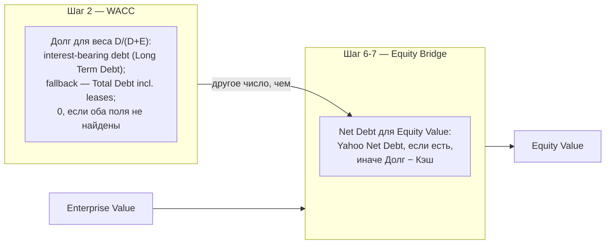

# Fundamental Express Analyzer

Автоматизированный фундаментальный анализ по методике экспресс-анализа (чеклист «грехов» баланса/кэш-флоу)
+ DCF-оценка справедливой стоимости (CAPM WACC). Данные — только реальные, с Yahoo Finance
через `yfinance`. **Без фоллбэка на мок-данные**: если Yahoo не отдал данные после серии
повторных попыток, скрипт прямо говорит об этом и ничего не рисует, вместо того чтобы
подсунуть правдоподобные, но вымышленные цифры.

Все сгенерированные отчёты (PDF/MD) и промежуточные графики попадают в `output/` и
`scratch/` — обе директории в `.gitignore`, в репозиторий не коммитятся.

**Архитектура.** Роутинг по сектору тикера идёт через `AnalyzerFactory` (`analyzers.py`):
`OrdinaryAnalyzer`, `BankAnalyzer` и `ReitAnalyzer` — три независимые реализации
`BaseAnalyzer` (`fetch_data`/`calculate_metrics`/`calculate_fair_value`/
`generate_markdown_report`/`generate_pdf_report`), каждая со своим чеклистом и своей
моделью оценки: `OrdinaryAnalyzer` — DCF/DDM (`compute_metrics()`, `domain/ordinary.py`),
`BankAnalyzer` — чеклист NII/Loan-to-Deposit и DDM/ROE-P-B (`compute_bank_metrics()`,
`domain/bank.py`), `ReitAnalyzer` — чеклист FFO/AFFO/NOI и NAV (`compute_reit_metrics()`,
`domain/reit.py`). Ни один не заглушка и не делегирует в другой — раньше
`BankAnalyzer`/`ReitAnalyzer` действительно были обёртками над `OrdinaryAnalyzer` под
`--force`, но с тех пор получили полноценные, независимые движки. `--force` больше не
требуется ни для банков, ни для REIT — флаг остался только на случай будущего сектора,
для которого секторная проверка снова начнёт что-то отклонять (сегодня она не
отклоняет ничего, см. «Применимость методики по секторам» ниже).

**Структура пакета (`src/fundamental_express/`).**

- `data/` — всё, что говорит с сетью/файловой системой: `yahoo.py` (клиент Yahoo Finance,
  FX-мост), `sample.py` (SAMPLE-фоллбэк), `parsing.py` (`find_row`, выравнивание
  отчётности по годам), `errors.py` (`DataUnavailableError`, `UnsupportedSectorError`).
- `domain/` — чистая логика без сети и файлового I/O: `sins.py` (реестр «грехов»,
  взвешенный скоринг, пороги вердикта), `valuation.py` (CAPM/WACC/DCF, DDM, NAV,
  ROE-P-B, форвардные мультипликаторы), `routing.py` (`check_sector_suitability`,
  `_is_reit`), `metrics.py` (dataclass'ы `OrdinaryMetrics`/`BankMetrics`/`ReitMetrics`),
  `ordinary.py`/`bank.py`/`reit.py` (чеклист-проверки каждого сектора).
- `reporting/` — рендеринг: `theme.py`/`flowables.py`/`tables.py`/`charts.py`
  (визуальные примитивы, без знания о секторах), `sections_ordinary.py`/
  `sections_bank.py`/`sections_reit.py` (какие разделы отчёта существуют для каждого
  сектора), `markdown.py`/`pdf.py` (по одному универсальному рендереру на формат,
  управляемому списком разделов — вместо шести отдельных report-builder функций).
- `cli/` — argparse-обвязка, изолированная от всего остального: `args.py`
  (`required_return_type`), `catalysts.py` (`resolve_catalysts_text`), `paths.py`
  (пути `output/`/`scratch/`), `single_ticker.py` (аргументы `financial_analyzer.py`),
  `portfolio.py` (весь `portfolio_analyzer.py`, включая его собственную сборку PDF).

`analyzers.py` (корень репозитория) — единственное место, где намеренно сходятся
`data/`, `domain/` и `reporting/`: `BaseAnalyzer` и три его наследника выполняют
fetch → compute → render, передавая готовые метрики и список разделов в
`reporting/pdf.py`/`reporting/markdown.py`. `financial_analyzer.py` и
`portfolio_analyzer.py` — тонкие входные точки (`cli.single_ticker:main`/
`cli.portfolio:main` соответственно), сохраняющие прежний вызов
(`python financial_analyzer.py TICKER`, `python portfolio_analyzer.py ...`).

## Установка

Требуется Python 3.13+ (см. `.python-version`).

```bash
uv sync
```

Зависимости и их версии зафиксированы в `pyproject.toml`/`uv.lock`. Без `uv`:

```bash
pip install yfinance pandas numpy matplotlib reportlab
```

**Системная зависимость:** PDF-отчёты используют шрифт DejaVu Sans (единственный
поддерживающий кириллицу шрифт, зашитый по пути
`/usr/share/fonts/truetype/dejavu/DejaVuSans.ttf`). Если его нет — скрипт тихо
переключится на Helvetica, и весь русский текст в PDF станет нечитаемым (пустые
глифы), с одним предупреждением в консоли. На Debian/Ubuntu: `apt install fonts-dejavu-core`.

## Одна компания

```bash
uv run python financial_analyzer.py MCD
```

Скачивает отчётность MCD за последние 4 года, считает чеклист «грехов», DCF fair value,
матрицу чувствительности и сохраняет `output/MCD_fundamental_report_2026-08-29.pdf` **и**
`output/MCD_fundamental_report_2026-08-29.md` (дата запуска в имени файла — повторный
запуск в тот же день перезаписывает, в другой день создаёт новый файл; одинаковый
контент, разный формат).

Опции:

- `--retries N` (по умолчанию 5) — сколько раз повторить запрос к Yahoo при сбое.
- `--retry-delay N` (по умолчанию 5) — пауза в секундах между повторами.
- `--allow-sample` — ТОЛЬКО для демо: разрешить мок-данные, если реальные так и не пришли.
  По умолчанию выключен: без реальных данных скрипт завершится с ошибкой
  `DataUnavailableError` (exit code 1), а не молча нарисует PDF на демо-цифрах Apple.
- `--catalysts "текст"` — свободный текст с катализаторами/рисками (запуск продукта,
  регуляторное событие, выход из репутационного кризиса), попадает в раздел 5 отчёта.
  Взаимоисключающий с `--catalysts-file`. Без обоих флагов раздел 5 печатает
  напоминание-плейсхолдер вместо выдуманных катализаторов (см. «Катализаторы» ниже).
- `--catalysts-file path/to/file.txt` — то же самое, но текст берётся из файла (UTF-8).
  Несуществующий файл — чистый выход с ошибкой, не traceback.
- `--force` — принудительно запустить анализ для банков/страховщиков/REIT, где чеклист
  и DCF математически некорректны (см. «Применимость методики по секторам» ниже). Без
  этого флага такие тикеры завершаются с ошибкой ещё до скачивания финансовых данных.
- `--required-return 0.12` (диапазон 0.05–0.25) — заменяет CAPM-расчёт Ke на заданную
  инвестором требуемую доходность (см. «Двухуровневая модель грехов» выше). Значение вне
  диапазона или похожее на процент вместо доли (`15` вместо `0.15`) отклоняется сразу, до
  любых сетевых запросов, с подсказкой правильного значения.

```bash
uv run python financial_analyzer.py MCD --retries 8 --retry-delay 8   # больше попыток и пауза при нестабильном Yahoo
uv run python financial_analyzer.py MCD --allow-sample                # демо-режим, если реальные данные недоступны
uv run python financial_analyzer.py MCD --catalysts "Запуск новой линейки в Q4; ожидаемое снижение ключевой ставки ФРС"
uv run python financial_analyzer.py MCD --catalysts-file notes/mcd_catalysts.txt
uv run python financial_analyzer.py JPM --force                       # банк — отчёт соберётся, но с красным баннером-предупреждением
uv run python financial_analyzer.py MCD --required-return 0.12        # своя требуемая доходность вместо CAPM
```

## Список компаний / портфель

```bash
uv run python portfolio_analyzer.py TSM:14 SAP:13 FICO:12 RELX:12 BR:12 VEEV:10 YUMC:8 NKE:7 SPGI:7 ACN:5
```

Формат каждого аргумента — `ТИКЕР:ВЕС`. Вес — просто подпись в отчёте (не обязан суммироваться
в 100, поддерживает дробные значения вроде `TSM:14.5`; тикер может содержать точку/дефис,
например `BRK.B:10`). Печатает сравнительную таблицу в консоль и собирает
`output/Portfolio_Comparative_Report_2026-08-29.pdf` и `.md` (дата в имени файла) с деталями
по каждому тикеру.

```bash
uv run python portfolio_analyzer.py AAPL:50 MSFT:50 --name TechDuo   # → output/TechDuo_Comparative_Report_<дата>.pdf
uv run python portfolio_analyzer.py TSM:100 --retries 8 --retry-delay 8
```

Если для какого-то тикера данные не пришли — он попадёт в таблицу как «нет данных», отчёт
всё равно соберётся по остальным. Никогда не подставляются мок-цифры вместо реального тикера.
В отличие от `financial_analyzer.py`, здесь нет флага `--allow-sample` — демо-режима для
портфеля не предусмотрено.

`financial_analyzer.py` и `portfolio_analyzer.py` считают метрики через один и тот же
`AnalyzerFactory` (`analyzers.py`) — оба в итоге вызывают `compute_metrics()`, так что числа
по одному и тому же тикеру в обоих отчётах гарантированно совпадают, это не два независимых
расчёта. `--required-return` в `portfolio_analyzer.py` применяется одинаково ко всем holdings:

```bash
uv run python portfolio_analyzer.py AAPL:50 MSFT:50 --required-return 0.10
```

**Отраслевой предохранитель (см. «Применимость методики по секторам» ниже) работает и здесь.**
Если в портфеле есть банк/страховая/REIT — весь запуск фейлится сразу, ещё до скачивания
остальных тикеров, той же ошибкой, что и в `financial_analyzer.py`. Флаг `--force` пускает
такой тикер в отчёт, но помечает его знаком `⚠️` прямо в тикере (`JPM ⚠️`) — и в консольной
таблице, и в PDF/MD — плюс сноска внизу таблицы, поясняющая значок:

```bash
uv run python portfolio_analyzer.py AAPL:10 MSFT:15 JPM:12          # упадёт на JPM, файлы не создаются
uv run python portfolio_analyzer.py AAPL:10 MSFT:15 JPM:12 --force  # соберётся, JPM помечен ⚠️
```

## Почему retries, а не мгновенный фейл

Yahoo Finance регулярно отдаёт `curl: (56)` (connection reset) или таймаут на отдельный
запрос — без всякой связи с самим тикером; повторный запрос через несколько секунд обычно
проходит. Поэтому `get_company_data()` ретраит несколько раз перед тем, как сдаться.

## Известные ограничения парсинга (чинили в этой сессии)

- **`find_row()`** ищет строку в отчётности по ключевым словам: сначала точное совпадение
  по всем ключевым словам, потом частичное. Раньше порядок был «точное → частичное для
  каждого ключевого слова по очереди», из-за чего, например, запрос "revenue" мог зацепить
  строку `Reconciled Cost Of Revenue` (себестоимость) раньше, чем добраться до точного
  совпадения `Total Revenue` — это раздувало чистую маржу до физически невозможных значений
  (>100%) и иногда переворачивало знак тренда выручки. Исправлено: теперь точные совпадения
  по всем ключевым словам проверяются первыми.
- **DCF fair value для TSM** выглядел поломанным (+880-920% к цене). Первая гипотеза
  (несовпадение базиса акций из-за ADR-структуры 1 ADR = 5 обычных акций) оказалась
  неверной — `price × sharesOutstanding` точно совпадает с `marketCap` от yfinance, базис
  акций в порядке. Настоящая причина: TSM подаёт отчётность в **TWD** (`info["financialCurrency"]
  == "TWD"`), а цена/акции/marketCap идут в **USD** (`info["currency"] == "USD"`) — DCF
  делил USD-цену на equity value, посчитанный из TWD-денежных потоков без конвертации.
  Исправлено: `get_company_data()` сравнивает `financialCurrency` и `currency`, при
  несовпадении тянет живой курс через тикер `f"{financial_ccy}{trading_ccy}=X"`
  (например `TWDUSD=X`) и конвертирует revenue/net income/equity/debt/cash/FCF в валюту
  торгов перед расчётом DCF. Если курс не получить — это считается неудачной попыткой
  фетча (retry), а не тихой работой на смешанных валютах. Чеклист «грехов» (ratio-based,
  сравнивает TWD с TWD) этим багом не задевался и ему можно было доверять и до фикса.
  После фикса DCF fair value TSM ≈ $99 при цене ≈ $414 (-76%, «переоценена» по модели) —
  разумный порядок величины, а не x9-x10 раздутие.
- Само DCF (WACC/CAGR/terminal growth) — упрощённая модель методики экспресс-анализа, не
  sell-side грейд: CAGR потолок 15%, terminal growth 2.5% фиксирован, WACC зажат в 5-15%.
  Это интерпретируемый ориентир, не прогноз.
- **Net debt и лизинг.** `Total Debt` от yfinance включает капитализированные обязательства
  по аренде (ASC 842) вместе с процентным долгом — для лизинг-тяжёлых бизнесов (рестораны,
  ритейл) это задваивает долговую нагрузку, если FCF уже отражает аренду как операционный
  отток. Долг, аренда, кэш и net debt теперь — отдельные поля (`interest_bearing_debt`,
  `lease_liabilities`, `total_debt_incl_leases`, `net_debt`), в отчёте показаны все вместе
  с указанием источника каждой цифры, ничего не смешивается в один "эффективный долг".
  **Допущение:** обязательства по аренде исключены из net debt, потому что FCF трактуется
  как поток после арендных платежей — это явно написано в каждом отчёте (PDF/MD). Если для
  конкретного сравнения это допущение не годится — в отчёте показан и `Total Debt` (со
  включённым лизингом) как альтернатива.
- `Kd = 4.5%` (pretax cost of debt) и `T = 21%` (налоговая ставка) в WACC — фиксированные
  допущения методики, не индивидуальный расчёт по компании и не её эффективная налоговая
  ставка. Явно помечено в отчёте.
- **`portfolio_analyzer.py` показывал «X/5» грехов** — число было взято из воздуха:
  реальное число проверок в чеклисте на тот момент было 7, затем расширили до 11 вслед
  за оригинальной лекцией, заменив взятое с потолка число на константу `MAX_SINS`. С тех
  пор чеклист пересобрали ещё раз — в двухуровневую модель критических/второстепенных
  грехов со взвешенным баллом вместо плоского счёта (`MAX_SINS` удалена, см. раздел
  «Методика» ниже) — так что «X из N» здесь больше не про число проверок вообще.

## Методика (кратко)

Вердикт (BUY/WATCH/SKIP) считается **не по DCF**, а по отдельному чеклисту «грехов» —
DCF отвечает на вопрос «по какой цене», чеклист — «стоит ли вообще смотреть». Каждый
пункт смотрит на последний отчётный год и на тренд год-к-году, независимо от
справедливой цены.

### Двухуровневая модель грехов (критические + взвешенные второстепенные)

Раньше вердикт считался по плоскому числу сработавших пунктов (0 / 1–3 / 4+ из 11,
все пункты равнозначны). Это наказывало сильный бизнес наравне с реально проблемным:
временный провал «шумной» чистой маржи стоил столько же, сколько сжигание кэша. Сейчас
чеклист — двухуровневый: **критические** грехи решают вердикт единолично, **второстепенные**
взвешены по тому, насколько напрямую они отражают реальное здоровье бизнеса.

**4 критических греха** — любой один из них сразу даёт 🔴 **ПРОПУСТИТЬ**, независимо от
остальных показателей:

1. **FCF ≤ 0** — компания жжёт кэш.
2. **Current Ratio < 1.0** — краткосрочные обязательства превышают краткосрочные активы,
   **если только не сработал «умный обход» ниже**.
3. **Долгосрочная неплатёжеспособность** — долгосрочные активы **за вычетом Goodwill**
   (гудвил нельзя продать при ликвидации) меньше долгосрочных обязательств.
4. **Отрицательный акционерный капитал** — Shareholders Equity ≤ 0.

**«Умный обход» для Current Ratio < 1.0.** Обвал ниже 1.0 сам по себе не всегда значит
беду — если компания одновременно генерирует положительный FCF и её кэш на балансе
покрывает краткосрочный долг (`Current Debt`/`Short Term Debt`, не всю сумму краткосрочных
обязательств), критический грех **не засчитывается**. Вместо этого начисляется
второстепенный штраф в 1.0 балл — именно так у Apple (CR ~0.89 при огромном FCF и кэше)
вердикт больше не улетает в автоматический SKIP из-за одной этой метрики. Обход **не
предоставляется**, если строка `Current Debt` не нашлась в отчётности тикера — послабление
никогда не даётся на отсутствии данных, только на подтверждённом факте.

**11 второстепенных грехов** — каждый даёт свой вес, веса суммируются в **балл**:

| Вес | Грехи |
|---|---|
| **1.0** (ключевые тренды бизнеса) | падение Shareholders Equity · падение FCF (если ещё положительный) · падение выручки · падение операционной прибыли · **размытие долей** (число акций выросло >1.5% год к году) · **CR < 1.0 после умного обхода** (см. выше) |
| **0.5** (промежуточные/условные) | падение Current Ratio, **только если он всё ещё < 2.0** (падение с 4.0 до 3.0 не считается) · падение Gross Margin · падение Operating Margin |
| **0.3** (шумные/вторичные) | падение Net Income · падение Net Margin — легче всего искажаются бумажными проводками, наименее показательны сами по себе |
| **−0.5** (бонус) | **байбэк** — число акций сократилось >1.5% год к году (вознаграждение за buyback, вычитается из суммы; итоговый балл никогда не уходит ниже 0) |

Максимальный балл — **8.1**. Вердикт при отсутствии критических грехов:

- балл **≤ 1.0** — 🟢 **КУПИТЬ**
- балл **1.0–2.5** — 🟡 **НАБЛЮДАТЬ**
- балл **> 2.5** — 🔴 **ПРОПУСТИТЬ**

Пороги специально не наказывают компанию за один-два незначительных шумных провала —
идеальных компаний не бывает, и обвал бумажной Net Margin у Apple/Microsoft не должен
триггерить тот же вердикт, что и системный упадок выручки+FCF+маржи одновременно.
Уровень/тренд у **Current Ratio < 1.0** взаимоисключающие: обвал ниже 1.0 засчитывается
только один раз (как критический грех либо, после умного обхода, как второстепенный) —
отдельно ещё и как второстепенный тренд ликвидности он не идёт.

**Персональная требуемая доходность (`--required-return 0.12`).** По умолчанию стоимость
собственного капитала (Ke) в DCF считается по CAPM (`Rf + β×ERP`). Флаг `--required-return`
(диапазон 0.05–0.25) полностью заменяет эту формулу на заданное инвестором значение —
удобно для личного «запаса прочности», отличного от рыночной беты. Значение вне диапазона
или похожее на процент, а не долю (например, `15` вместо `0.15`) отклоняется с понятной
подсказкой ещё до обращения к Yahoo Finance — тихого зажатия (clamping) нет намеренно:
неверно интерпретированная ставка дисконтирования молча даёт правдоподобную, но неверную
справедливую цену.

### Форвардные мультипликаторы (раздел 4 отчёта)

Раздел 4 — справочный противовес DCF, который целиком построен на экстраполяции
исторических 4 лет: Forward P/E, ожидаемый рост (консенсус-оценки аналитиков) и PEG с
цветовой маркировкой (<1.0 — недооценена с учётом роста, 1.0–2.0 — справедливо, >2.0 —
переоценена). Каждое поле у Yahoo Finance часто пустое — используется цепочка фоллбэков
(Forward P/E → Trailing P/E; консенсус EPS-роста → консенсус роста выручки →
исторический CAGR FCF из DCF), каждое значение подписано источником, чтобы прокси
никогда не выдавался за реальный консенсус. Раздел не влияет на балл выше — это
отдельный, дополняющий взгляд.

### Катализаторы и риски (раздел 5 отчёта)

DCF справедливая стоимость может не реализовываться рынком годами, если у него нет
триггера для переоценки (запуск продукта, регуляторное изменение, выход компании из
временного репутационного кризиса). Такие катализаторы — не фетчable данные, это
суждение аналитика, поэтому инструмент их не придумывает и не подбирает автоматически:

- `--catalysts "текст"` — вписать текст прямо в командной строке.
- `--catalysts-file path.txt` — взять текст из файла.
- Ни то ни другое — раздел 5 печатает напоминание-плейсхолдер вместо выдуманного
  катализатора («заполните вручную перед принятием решения»).

Флаги взаимоисключающие — при передаче обоих сразу скрипт завершается с ошибкой ещё
до обращения к Yahoo Finance.

### Применимость методики по секторам

Current Ratio и стандартный FCF-based DCF математически некорректны для **финансовых
компаний** (банки, страховые, capital markets — нет привычных Current Assets/Liabilities)
и **REIT** (оцениваются по FFO/AFFO, а не по FCF). По умолчанию скрипт **фейлится сразу**
для таких тикеров, ещё до скачивания финансовой отчётности:

```
Ошибка: Тикер JPM относится к сектору Financial Services (Banks - Diversified).
Экспресс-методика и классический DCF не применимы к финансовым компаниям и REIT.
Используйте флаг --force для принудительного запуска.
```

Флаг `--force` снимает этот запрет и запускает анализ под ответственность пользователя —
но при этом в самое начало и PDF, и Markdown отчёта вставляется яркий красный баннер с
предупреждением, что ликвидность и DCF для этого сектора могут быть некорректны.
Проверка сектора не распространяется на обычных застройщиков/девелоперов недвижимости
(`sector == "Real Estate"`, но не REIT по `industry`) — у них обычный баланс и реальный FCF.

Та же проверка и тот же `--force` есть и в `portfolio_analyzer.py` (см. «Список компаний /
портфель» выше) — там вместо полноразмерного баннера тикер помечается значком `⚠️` в таблице,
чтобы одна проблемная строка не терялась среди остальных holdings в сравнительном отчёте.

**DCF (как считается справедливая цена акции), шаг за шагом:**

1. **Темп роста FCF (CAGR)** — по историческому FCF за 4 года:
   `CAGR = (FCF_последний / FCF_первый)^(1/N) − 1`, зажат в границах 2–15%
   (если история недоступна/отрицательна на краях — дефолт 5%).
2. **WACC по CAPM:**
   - `Ke = Rf + β×ERP = 4% + β×5%` (бета — из yfinance)
   - `Kd_after_tax = Kd×(1−T) = 4.5%×(1−21%)` (Kd и T — фиксированные допущения методики,
     не расчёт по конкретной компании)
   - веса `E/(D+E)` и `D/(D+E)` — по **рыночной капитализации**, не по балансовому капиталу
     (важно для компаний с отрицательным book equity)
   - `WACC = вес_E×Ke + вес_D×Kd_after_tax`, зажат в границах 5–15%
3. **Прогноз FCF на 5 лет вперёд** по найденному CAGR, каждый год дисконтируется по WACC.
4. **Терминальная стоимость** (формула Гордона, рост фиксирован на 2.5%):
   `TV = FCF_год5×(1+2.5%) / (WACC−2.5%)`, тоже дисконтируется к текущему моменту.
5. **Enterprise Value** = сумма продисконтированных FCF за 5 лет + продисконтированная TV.
6. **Net Debt** — предпочтительно берётся готовое поле `Net Debt` от Yahoo Finance (уже
   без учёта лизинга); если его нет — считается как `Долгосрочный долг − Кэш`. Обязательства
   по аренде исключены как явное допущение (см. выше).
7. **Equity Value** = Enterprise Value − Net Debt.
8. **Справедливая цена акции** = Equity Value / число акций.
9. **Вердикт**: если отклонение факт. цены от справедливой >10% — «переоценена»/«недооценена»,
   иначе «оценена справедливо».

**Важно:** в модели два разных значения «долга», не путать местами:



- в WACC (шаг 2) вес долга считается по **interest-bearing debt** (Long Term Debt;
  если не найден — Total Debt включая лизинг; 0, если оба поля отсутствуют);
- в equity bridge (шаг 6-7) вычитается отдельно посчитанный **Net Debt** (см. шаг 6) —
  это не то же число, что вошло в WACC.

**Beta:** если Yahoo Finance не публикует бету для тикера, используется дефолт
`β = 1.1` — это напрямую двигает Ke и WACC, а не только «бета из yfinance».

**EPS не конвертируется по курсу.** Для эмитентов с валютным расхождением
(`financialCurrency` ≠ `currency`, как у TSM) все денежные строки конвертируются в
валюту торгов — **кроме EPS**, которая остаётся в валюте домашнего рынка и на 1
обыкновенную акцию, а не на 1 ADR. Сопоставлять такую EPS напрямую с ADR-ценой
нельзя; известное неисправленное ограничение.

Отдельно от DCF — чеклист «грехов» (пункт выше) даёт вердикт BUY/WATCH/SKIP независимо от
DCF-числа: DCF отвечает "по какой цене", чеклист — "стоит ли вообще смотреть".

Методика экспресс-анализа прямо указывает: фундаментальный анализ отвечает на вопрос «что
покупать», а точку входа по времени нужно определять в связке с техническим анализом —
эти отчёты не заменяют этот шаг.
